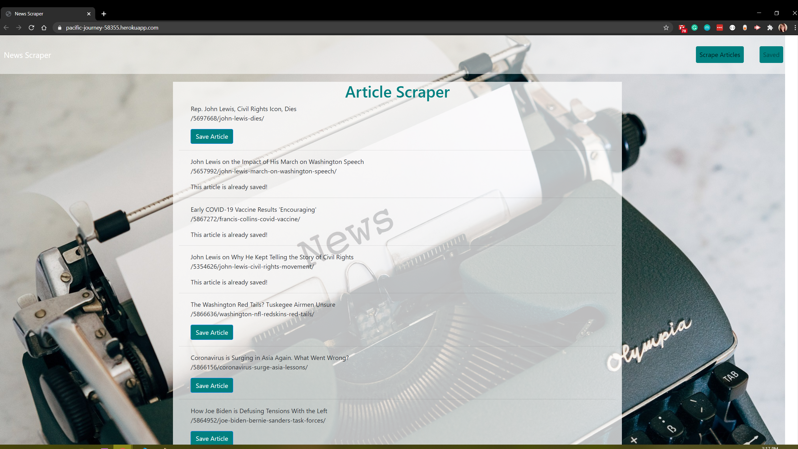

<!-- PROJECT SHIELDS -->

[![Contributors][contributors-shield]][contributors-url] [![Forks][forks-shield]][forks-url] [![Stargazers][stars-shield]][stars-url] [![Issues][issues-shield]][issues-url] [![LinkedIn][linkedin-shield]][linkedin-url]

 
<h3 align="center">News Scraper</h3>
<p align="center">
This application allows a user to scrape news articles from time.com and allows the user to save them. The user can then add notes to their saved articles.
<br />
<br />
<a href="https://pacific-journey-58355.herokuapp.com/">View Demo</a>
·
<a href="https://github.com/celupanow/news-scraper/issues">Report Bug</a>
·
<a href="https://github.com/celupanow/news-scraper/issues">Request Feature</a>

</p>

</p>
<!-- TABLE OF CONTENTS -->

## Table of Contents

* [About the Project](#about-the-project)
	* [Built With](#built-with)
* [Getting Started](#getting-started)
	* [Prerequisites](#prerequisites)
	* [Installation](#installation)
* [Roadmap](#roadmap)
* [Contact](#contact)
* [Acknowledgements](#acknowledgements)

 
<!-- ABOUT THE PROJECT -->

## About The Project



### Built With
* [HTML](https://developer.mozilla.org/en-US/docs/Learn/HTML)
* [CSS](https://developer.mozilla.org/en-US/docs/Web/CSS)
* [Materialize](https://materializecss.com/)

<!-- GETTING STARTED -->

## Getting Started
To get a local copy up and running follow these simple steps.


### Prerequisites

You will need to have the lastest version of npm installed.
* npm
```sh
npm install npm@latest -g
```
  
### Installation

1. Clone the repo

```sh

git clone https://github.com/celupanow/news-scraper.git

```
2. Install the NPM packages
```sh
npm install
```

<!-- ROADMAP -->

## Roadmap

  

See the [open issues](https://github.com/celupanow/news-scraper/issues) for a list of proposed features (and known issues).

<!-- CONTACT -->

## Contact

  

Christina Lupanow - christina@christinalupanow.com

  

Project Link: [https://pacific-journey-58355.herokuapp.com/](https://pacific-journey-58355.herokuapp.com/)

<!-- ACKNOWLEDGEMENTS -->

## Acknowledgements

  

* [Heroku](https://heroku.com)
* [Time](https://time.com)

<!-- MARKDOWN LINKS & IMAGES -->

<!-- https://www.markdownguide.org/basic-syntax/#reference-style-links -->

[contributors-shield]: https://img.shields.io/github/contributors/celupanow/news-scraper.svg?style=flat-square

[contributors-url]: https://github.com/celupanow/news-scraper/graphs/contributors

[forks-shield]: https://img.shields.io/github/forks/celupanow/news-scraper.svg?style=flat-square

[forks-url]: https://github.com/celupanow/news-scraper/network/members

[stars-shield]: https://img.shields.io/github/stars/celupanow/news-scraper.svg?style=flat-square

[stars-url]: https://github.com/celupanow/news-scraper/stargazers

[issues-shield]: https://img.shields.io/github/issues/celupanow/news-scraper.svg?style=flat-square

[issues-url]: https://github.com/celupanow/news-scraper/issues

[license-shield]: https://img.shields.io/github/license/celupanow/news-scraper.svg?style=flat-square

[license-url]: https://github.com/celupanow/news-scraper/blob/master/LICENSE.txt

[linkedin-shield]: https://img.shields.io/badge/-LinkedIn-black.svg?style=flat-square&logo=linkedin&colorB=555

[linkedin-url]: https://linkedin.com/in/celupanow

[product-screenshot]: images/screenshot.png
<!--stackedit_data:
eyJoaXN0b3J5IjpbLTYxOTc1NDE1NCwtMTQ4MTc1MDQ1MCwxMj
M3Njg1OTMwLC00NDQyNzI4MjRdfQ==
-->